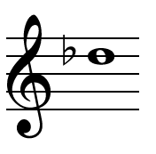

# &lt;musical-note&gt;

A custom HTML element for a musical note in treble clef. See usage examples and a live demo here [http://pianosnake.github.io/musical-note/](http://pianosnake.github.io/musical-note/)

## Install

Download the musical-note.js file from this repo and load the file into your page's HEAD section. The script can also be referenced directly from github:

```
<script src="//pianosnake.github.io/musical-note/musical-note.js"></script>
```

Create a musical-note tag in the BODY of your page: 

```
<musical-note value="db5"></musical-note>
```
An SVG image will be inserted with the given value



## License

[MIT License](http://opensource.org/licenses/MIT)
